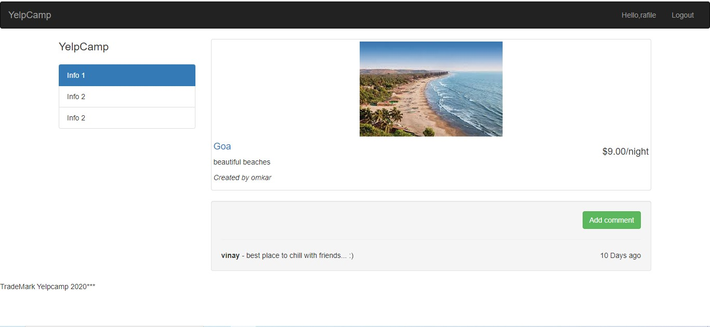

# YelpCamp
yelpcamp a website consist of campgrounds (places for camps and tours) in which user can enter a new a campground, check reviews of any specific campground and give review to his campground.

 
   
  

 
Homepage
 

 
Add Campgrounds
 

 
Campground
 

